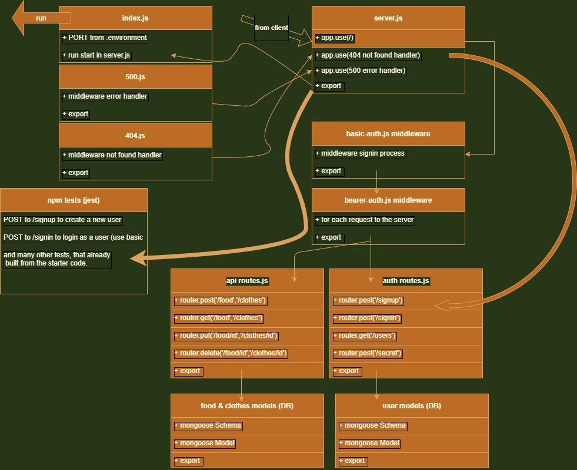

# auth-api

**Author: Ahmad Abu Osbeh**
<br>

- tests report
- back-end

**Setup**
<br>

- .env requirements
- PORT - 3003
- Running the app
- npm start
- Endpoint:

**user data**

```
data should be:
 const obj =  {
   "name":"ahmad",
  "password": 1234,
  "role": "admin"
  };

```

**1- food data**

```
data should be:
 const obj =  {
   "name":"orange",
  "calories": 250,
  "type": "FRUIT"
  };

```

**2- clothes data**

```
data should be:
 const obj =  {
   "name": "T-shirt" ,
  "color": "white" ,
  "size": "M"
};

```

**example hit :**
[sign up](https://ahmad-osbeh-auth-api.herokuapp.com/signup)

- https://ahmad-osbeh-auth-api.herokuapp.com/signup

**example hit :**
[signin](https://ahmad-osbeh-auth-api.herokuapp.com/signin)

- https://ahmad-osbeh-auth-api.herokuapp.com/signin
- https://ahmad-osbeh-auth-api.herokuapp.com/users

- Returns : json with requested data

```

{
"domain": "https://ahmad-osbeh-auth-api.herokuapp.com/",
"status": "running",
"port": 3003
}

```

# PR link

[PR link](https://github.com/Ahmad-AbuOsbeh/auth-api/pull/1)

- https://github.com/Ahmad-AbuOsbeh/auth-api/pull/1

**Tests**

**using supertest and jest**

- Unit Tests: npm run test

# UML

<br>


